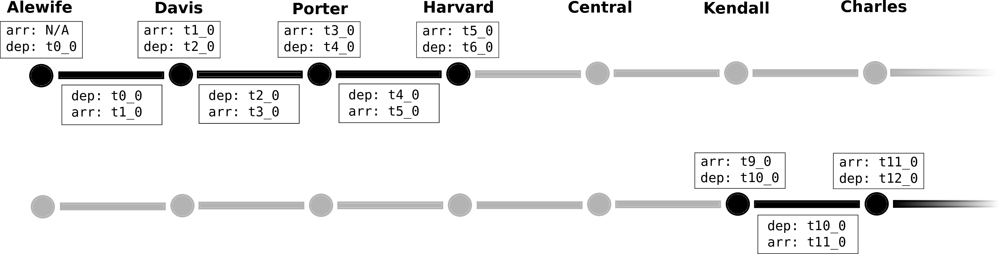

# MBTA Performance API

## Origins

Anyone who has ever commuted by subway (NY, DC, Boston, etc.) will have run into
mystery delays. Whether on the platform, or in a train, the delays are sudden,
and inevitably infuriating as the transit authority almost never gives riders
full information about the situation. The MBTA of Boston may indicate the cause
of the delay over their alert feed, and may describe the delays in vague terms
like "minor" or "moderate", but what do those terms actually mean? 

When I began this short project, I had the goal of quantifying these qualitative
terms to their actual affects on riders' commutes. Or perhaps modeling expected
delays due to different weather conditions. After exploring the data available
from different transit authorities, I found that the MBTA of Boston had a web
API that yields historical train performance data. Nice, no need to scrape
real-time data for months on end! I thought it'd be fairly straight forward to
jump right into the modeling after a little data consolidation...

The data available turned out to be much more challenging to wrangle than
previously thought. I therefore shifted the goal of the project to be
simplifying data extraction from the MBTA API, and putting the data in a form
that would actually be useful during further analysis.

## Challenges

To understand the data challenges, let me first lay out the structure of the
data in the MBTA API. Fundamentally, as a train travels through the system, it
is in one of two states: stopped at a station, or travelling between stations.
By tracking all the stops and movements of the train through the system, you can
determine the time it takes to travel between any set of stops. The baseline
performance can be established from many trains at different times of the day,
and delays can be compared against the baseline.

In the MBTA API, the stop and travel infomation is not consolidated on a
per-train basis as would be desirable. It rather requires you to query the stops
at each station separately, using a station ID number defined in another API.
The travel times between stop pairs must also be queried individually.
Technically the API could be queried for the travel times between any stop pairs
along the line. This would yield an enormous amount of redundant data if you
already have data for the "nearest-neighbor" station pairs, and essentially
squares the amount of data that needs to be queried, stored, and analyzed. I
therefore restrict the travel data to the “nearest-neighbor” station pairs. In
the end, this yields a collection of train "events" in a number of separate files
that need to be combined together: for example on the Red line, a stop at Davis
is connected to a travel between Davis and Porter, connected to a stop at
Porter, connected to a travel between Porter and Harvard, etc. 

What makes this difficult is that only timing data is provided for the trains,
no train IDs. You therefore have to take the train that travels from Davis
to Porter, and match it to the same train that stops at Porter by matching
the time that the train arrived at Porter (provided in both the travel time
and stop time files). The primary challenge here is to efficiently do
this chaining if you have a dataset with thousands of possible matching
segments.

This procedure would be fairly straight forward if the train data were fully
populated. Unfortunately, train data can be somewhat sparse between some station
pairs for some reason. This means that chaining will produce many train
fragments that ideally would be connected into single trains.

## Consolidation Strategy

To tackle the first challenge (chaining the right train segments efficiently and
correctly out of thousands of possible combinations), fortunately the MBTA API
yields time ordered train events. If you start with the earliest possible train
segment, you only have to look near the front of the list of train events in other
segments to do the matching. These matching segments can then be removed from
the list so you don't waste time later with these already-used segments. As this
is a largely pop-from-front process, a `deque` of train events in each track
segment and stop is used and makes the chaining process efficient. An idealized
schematic is shown below.

Here, `t0_0` is the earliest available departure time, so that time will be
popped first. The following segments are iterated over, and matching times (in
red) are popped as well until a matching time is not found, or the end of
the line is reached.

## Project Structure

